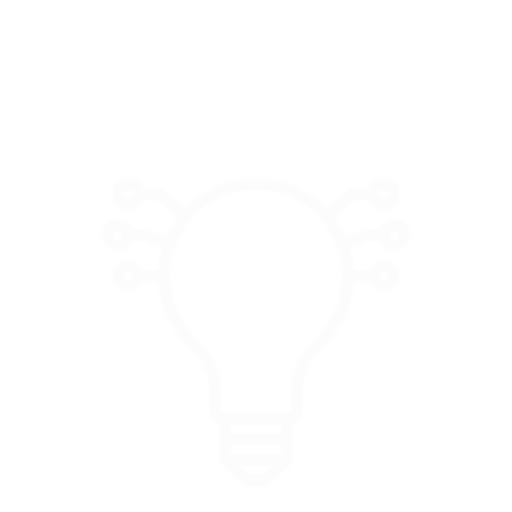

# 

# Logo Design ReadMe

## Overview
This logo has been designed to encapsulate the essence of innovation, artificial intelligence (AI), and the Internet of Things (IoT). It combines key elements symbolizing modern technological advancements and interdisciplinary connectivity.

## Components and Symbolism

1. **Bulb:**
    - Represents **innovation** and **creativity**, acting as a universal symbol for ideas and breakthroughs.
    - Highlights the core purpose of driving innovation through technology.

2. **Network Connections Around the Bulb:**
    - Symbolize **AI neural networks**, representing the intelligence and learning capabilities inherent in modern AI systems.
    - These connections emphasize the intricate and interconnected nature of neural networks.

3. **Wi-Fi Signals:**
    - Denote **IoT (Internet of Things)** and **connectivity**, representing how various technological fields are seamlessly linked.
    - Highlight the role of wireless communication and the integration of smart devices.

## Interpretation
The logo embodies the synergy between innovation, AI, IoT, and connectivity. It reflects a STEM-oriented (Science, Technology, Engineering, and Mathematics) perspective, symbolizing interdisciplinary collaboration and technological progress.

## Use Cases
This logo can be used in:
- Tech startups or companies focusing on AI, IoT, and innovation.
- Educational platforms promoting STEM learning and technologies.
- Products or services at the intersection of AI and IoT.

## Key Highlights
- The **minimalistic design** ensures the logo is versatile and adaptable for different mediums.
- The **universal appeal** of the bulb and wireless signals ensures instant recognition and relatability.
- The **symbolism** bridges the gap between abstract concepts like neural networks and tangible ideas like IoT devices.

## Conclusion
This logo is a visual representation of interdisciplinary technological advancements, symbolizing the seamless integration of AI, IoT, and innovation. It is designed to inspire and resonate with individuals and organizations working in cutting-edge tech fields.

-----------------------------Raw resources "Designed by Freepik" --------------------------